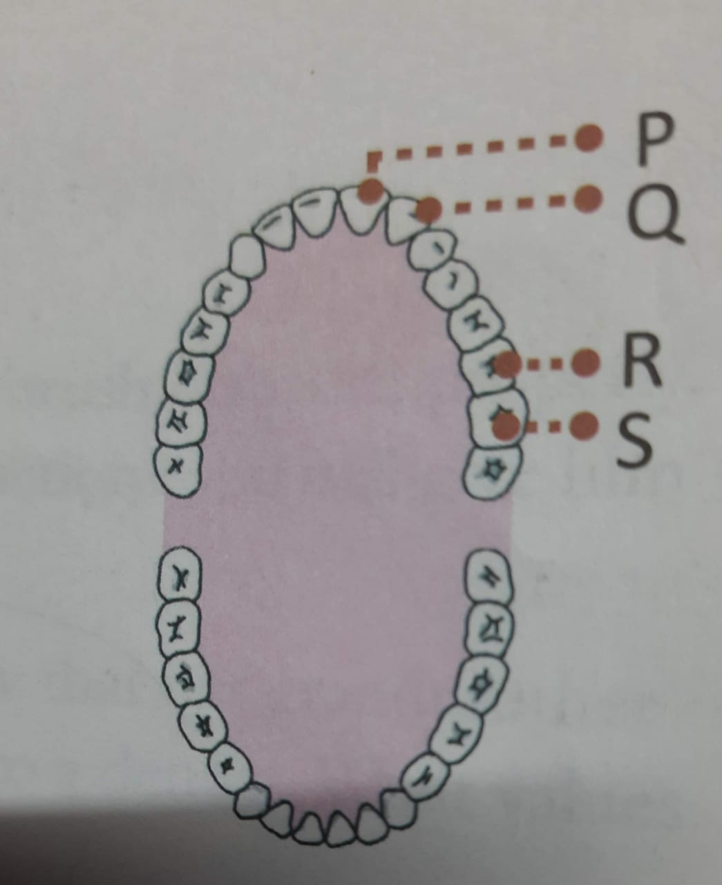
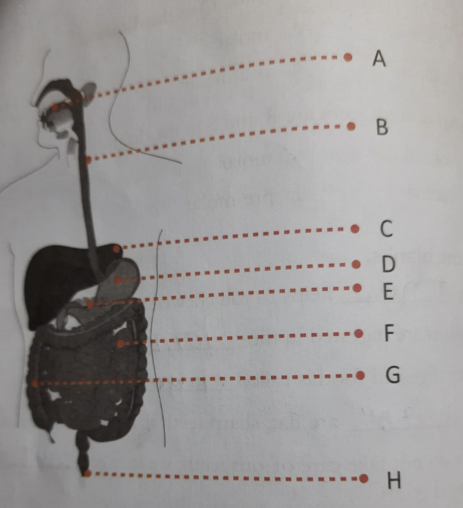

```{r setup, include = FALSE}
library(knitr)
library(tidyverse)
library(nhsrtheme)
devtools::install_github("gadenbuie/xaringanExtra")
library(xaringanExtra)
xaringanExtra::use_tile_view()
# set default options
opts_chunk$set(echo = FALSE,
               fig.width = 7.252,
               fig.height = 4,
               dpi = 300)

# uncomment the following lines if you want to use the NHS-R theme colours by default
# scale_fill_continuous <- partial(scale_fill_nhs, discrete = FALSE)
# scale_fill_discrete <- partial(scale_fill_nhs, discrete = TRUE)
# scale_colour_continuous <- partial(scale_colour_nhs, discrete = FALSE)
# scale_colour_discrete <- partial(scale_colour_nhs, discrete = TRUE)
```

class: title-slide, left, bottom

# `r rmarkdown::metadata$title`
----
## **`r rmarkdown::metadata$subtitle`**
### `r rmarkdown::metadata$author`
### `r rmarkdown::metadata$date`

---
class: inverse, middle, center

# An inverse slide

Often used for transitions


???
This is an example of presenter notes

---

# A slide where bullets appear

--

* first point

--

* second point

--

* third point


---

# About Me


* Master of International Affairs from Columbia University (NYC) with 20 years of in‐depth hands‐on experience in Corporate Social Responsibility, Employee Engagement & Community Development. Proven ability to manage large scale projects with strong communication, stakeholder management and analytical skills. Highly effective at creating multi- stakeholder social initiatives with sustainable community impact.


* Key Skills Strategic Program Development and Management, Stakeholder Management, Compliance Management, Logframe Analysis, Monitoring and Evaluation, Qualitative and Quantitative Research, Reporting and Analytics.


-- 

* Area of Expertise Corporate Social Responsibility and Community Development, Employee Engagement, Supply Chain Sustainability, GRI and CSR Reporting, Education and Skill Development.


[Checkout My Resume Here](http://onkarsingh.rbind.io/resume_onkar_singh.pdf/)


---
class: inverse, middle, center

# Chapter 9: Matter and Its States


---
# Choose the correct answer. 

* The space between molecules is smallest in____

  + Solid

* The process by which water become water vaport is called

  + Evaporation

* The process by which water vapour becomes water

  + Condensation

* Sublimation is the process by which
  + Solid turns into gas

* A substance that dissolves in another substance is called 

  + Solute
  

---
# Fill in the blanks

  + Matter is made of tiny particles called (molecules)

  + The space between molecules is the most in (gas)

  + (gas) have to be stored in closed containers

  + An exammple of a substance that undergoes sublimation is (camphor)

  + A solute and a solvent together form a (solution)

---
## What are the processes marked A, B, C, D and E ? 

  + A. Liquid to Solid (Freezing)
  
  + B. Gas to Liquid (Condensation)
  
  + C. Solid to Liquid (Melting)
  
  + D. Liquid to Gas (Evaporation)
  
  + E. Solid to Gas (Sublimation)

--- 

---
# Answer the folowing questions

* What is matter? Name the three states of matter and give examples of substances in each state

  + Matter is anything that takes up place and has weight
  + Theree states of matters are Solid, Liquid and Gas
  + Solid: Wood, Glass
  + Liquid: Water and Oil
  + Gas: Oxygen and Carobon Dioxide

* List two differences between solids, liquids and gases

  + Molecules in the solid are closely packed, they have definite shape and volume
  
  + The space between between the molecules is more in liuid than solid, liquid doesnt have definite shape but liquid has definite volume
  
  + The molecules in gas are far away and they have lot of space to move, gases have neighter definate shape or nor definite volume. 

---
## Q&A Continued
* What is sublimation? Explain the process with an example? 

  + The submitation is a process in which solid turns into gas directly without turning into liquid, when heated. e.g. camphor when it is kept in open or heated it directly turns into gas without turning into liquid. 


--- 
## Q&A Contintued

* Define the follwoing terms: solute, solvent, solutioon

  + Solute: The substance which is dissolved in the solvent is called solute. e.g. Sugar is a solutin in the solution made up of water and sugar. 
  + Solvent: The susbtance in which the solute dissolves is called the Solvent
  + Solution: The substance which is formed by dissolving a solute in a solvent is called Solution. 


--- 
## Q&A Contintued
* What is a saturated solution? Does a saturated solution always hold the same amount of solute? 

  + A saturated solution is a solution in which the solvent cannot dissolve any more solute at a given temperature. A solution may dissovle more solute if it heated. 


---
class: inverse, middle, center
# Chapter 11. The Environment


---
## To sum up

* The environment includes everything that sorrounds us. 

* We get all that we need from the environment- food, shelter and everything else

* Some of our activities, like cutting trees, hunting animals and dumpting wastes, have harmed the environment. 

* Air, water and soil have been polluted, leading to health and environmental problems. 

* Waste can be classified as biodegradable and non-biodradable. 

* We should follow the 4 R rule (reduce, reuse, recycle and recover) to save the environment. 


---
## Choose the correct answer: 

* What do we get from the environment? 

 + Alll of these i.e. Water, food, light. 
 
* Which of the following is the best way to reduce air pollution? 

 + walking or using a bicycle to go to nearby places. 
 
* Why should we recyle materials? 

 + A. to reduce pollution
 
 + B. to protect the environment
 
 + C. to reduce waste
 
 + D. to save money
 
 + **A, B, C and D**
 
 
---
## Sort the following materials into two categories- biodegradable and non-biodegradable

* Vegetable peel, alumninium foil, pencil shavings, cotton candy, plastic scale, paper, napkin, plastic raincoat, jute bag, glass bottle, fot-drink can, light bulb

  + **Biodegradable**
    * vegetable peel 
    * 
    * 
    *
    *
    *
    *
    *
    
  + **Non-biodegradable**
  
    * 
    *
    *
    *
    *
    *
    *
    *
    
    


---
## Fill in the blanks

* Humans depend directly or indirectly on the (environment) for their needs. 

* Sustances that harm the environment are called (pollutants). 

* Air pollution can lead to (acid) rain. 

* The engergy that we get from the moving water is called (hydro-electric) engergy. 

* Garbage bins are good places for () and () to live and multiply. 


---
## Answer the following questions

1. Define the term 'environment'. 

* 

2. In what ways do we depend on the environment? 

*

3. List a few causes of water pollution? 

*

4. Give two ways by which we can reduce soil pollution. 

*

5. Explain the difference bewteen biodegradable and non-biodradable materials using examples. 

*


---
class: inverse, middle, center
# Chapter 5 Food and Nutrition


---
## Chatper 5: To sum up

* Nutrition (taking in food) is important for proper growth and health. 

* Carbohydrates and fats give us energy. 

* We need proteins for growth and to repair worn-out or injured parts of the body. 

* Vitamins and minerals protect our body against diseases. 

* We must have water and roughage in our diet. 

* A blaanced diet contains all the nutrients that we need in teh right amounts to be healthy . 

* Excercise is good for our body and mind. 

* We cook food to make it easier to eat and digest. 

* We can preserve food by boiling, freezing, dring, canning, bottling or adding preservatives. 


---
## Chatper 5: Choose the correct Answer

* A diet containing only large amounts of carbohydrates and fats will 
  + make you fat
  * not let you grow well
  * make you unhealthy
  * **all of the above**
  
* What kinds of food are good sources of proetein

  + **meat, eggs, soya and fish**
  
  + fruits, vegetables
  
  + rice, bread
  
  + milk, butter, ghee
  
 
* A balanced diet contains 
  + no fats
  
  + different foods from the same food group
  
  + **food from all food groups**
  
  + only fruit and vegetables
 
 
* A good method of preserving frutis and vegetables is

  + cooking
  
  + boiling
  
  + **refrigeration**
  
  + washing
  
* Which of the followings do we need for healthy and strong teeth

  + vitamin C
  
  + Vitamin C and Calcium
  
  + Vitamin D
  
  + **Vitamin D and Calcium**
  


---
## Chapter 5: Fill in the blanks to form similar pair of words

* body-building goods and protein/protective foods and vitamins and minerals. 

* cheese and *protein*/butter and fats. 

* *iron* and blood/calcium and bones. 

* carrot and vitamin A/*orange and lemons* vitamin C


---
## Chapter 5: Decide if each statement is true or false. Cirlce the letter in the correct column. 

* Proteins are main source of energy (False/N)

* Some foods don't contain balanced amounts of nutrients (True/U)

* People need nutrients to be healthy (True/T)

* There are two main types of nutrients (False/R)

* Fats are a source of energy (False/I)

* Vitamins protect us from illness (True/T)

* Calcium is a carohydrate (False/I)

* Milk contains iron (False/O)

* We need a balanced diet to be healthy (True/N)

* Write the letters that you have circled to get the name for the scienc of food. 

  + **NUTRITION**
---
## Chapter 5:  Answer the following questions

* Why do we need food to be healthy? 

  + Food gives us engergy to perfrom our activities. It contains nutrients that helps us grow and keep us safe from diseases. 

* Name the basic food groups and give two food sources of each of them. 

  + Carbohydrates: rice and wheat
  
  + Protein: pulses and beans
  
  + Fats: ghee and oil
  
  + Vitamin: fruits and vegetables
  
  + Minerals: fruits, vegetables, seeds, sprouts

* Carbohydrates and fats are energy giving foods. Why are they important in our diet? 

  + Carbohydrates give us the engergy required to perform our regular tasks. 


  


---
## Chapter 5 Q&A continued

* Why do young children need more portein than adults? 

  + Our body needs protein to grow and repair injured parts. Growing children need more protein as they are growing while the adults are already grown ups. 

* Water and excercise are as important as a balanced diet. Justify this statement. 

  + Water and exercise are as important as balanced diet because water helps digest food and absorb digested food. A balanced diet without water will lead to no absorbption of nutrients. 
  
  + without exercise a person becomes lazy or obesse, good nutrition without propoer excerise is of no use as health is absent. 
  
  + balanced diet + water + exercise  = good health


---
class: inverse, middle, center

## Chapter 6: Digestion and Our Teeth


---
## Chapter 6: To sum up

* Food is broked down into simple substances by digestion. 

* Digestion starts in the mouth and ends in the small intestine. 

* The juices produced by the mouth, stomach, pancreas, livers and small intestine helps in digesting food. 

* Water is absorbed in the large intestine. 

* The undigested part of food is sent out through the anus. 

* Young children have milk teeth, while adults have permanent teeth. 

* Every tooth has three layers - **enamel, dentine and pulp.**

* We have four types of teetch - **incisors, canines, pre-molars and molars **

* Each type of tooth has a different shape and size according to its use. 

* We should take care of our teeth to avoid cavities, bad breadth and diseased gums. 

* We should follow good eating habits to be healthy. 


---
## Chapter 6:  Choose the correct answer

* In which process does saliva not play a role

  - digestion
  
  - **excretion of undigested food**
  
  - swallowing food
  
  - making food softer

* The  process of digestion begins in the **(mouth)**

* The water in the food is absorbed in the **(large intestine)**


---
## Chapter 6:  Choose the correct answer contd..

.pull-left[
```{r}

```

  ]

  

  
  .pull-right[
  
  
* What type of teeth are P and Q inteh diagram? 

  - **incisor**
  - canine
  - molar
  - pre-molar
  
  
* What type of teeth are R and S in the diagram? 

 - incisor
  - canine
  - **molar**
  - pre-molar
 ] 
---
## Chapter 6:  Fill in the blanks

* The (tongue) helps to roll chewed food before it is swallowed. 

* Proteins are digested in the (stomach)

- Partly digested food is called (chyme)

- The (incisor) are flat, sharp teeth that helps us to bite our food. 

- If we dont take are of our teeth, we may get (cavities), bad breadth and diseased gums. 


---
## Chapter 6: Fill in the blanks for form similar pair of words

- mouth and (tognue) / small intestine and fats

- mouth and saliva / liver and (bile)

- milk teeth and 20 / permanent teeth and (32)

- (incisors) and cutting teeth / molars and grinding teeth. 


---
## Chapter 6:  Answer the following questions

* Look at the picture on the next page


```{r}

```


  - a. Lable the parts marked in the picture
  
  - b. What happens in the parts marked A and D? 
  
  - c. What is the funciton of part B? 
  
  - d. What are produced by the parts marked C and D? 
  
  - e. What are the funcitons of the parts marked F and G? 

 
* Draw and label the parts of a tooth. 

* Why are milk teeth also called temporary teeth? How many milk teeth do humans have? 

* What is the function of enamel? 

* List four steps that you neeed to follow to have healthy teeth. 

---
class: centre, top

## Emoji slide


```{r include = FALSE}
# devtools::install_github("hadley/emo")
```


`r emo::ji("tada")`


```{r include = FALSE}
# devtools::install_github("ropenscilabs/icon")
```

---
## Insert Picture Slide


---
## Tables 
Direct input

```{r}
NHSRdatasets::LOS_model %>% 
  head() %>% 
  # knitr::kable(format = "html") # or 
# DT::datatable() or 
  gt::gt()
```

---
## Plots(codes on the left, graph on the right)


.pull-left[
```{r plot-last, fig.show = "hide"}

NHSRdatasets::LOS_model %>% 
  ggplot(aes(x = Age, y = Organisation)) + 
  geom_boxplot(aes(fill = Organisation)) + 
  nhsrtheme::scale_fill_nhs("highlights")

```
]

.pull-right[
```{r ref.label = "plot-last", echo = FALSE}

```
]


---
## Plots(plots on the left, codes on the right)


.pull-left[
```{r plot-first, echo = FALSE}
NHSRdatasets::LOS_model %>% 
  ggplot(aes(x = Age, y = Organisation)) + 
  geom_boxplot(aes(fill = Organisation)) + 
  nhsrtheme::scale_fill_nhs("highlights")
```

]

.pull-right[
```{r ref.label = 'plot-first', fig.show = 'hide'}

```

]


---
# .pull-left[] .pull-right[] example one 


.pull-left[
# Arya content on the left

* Point 1

* Point 2
]

.pull-right[
# Vivang content on the right

* Point 3

* Point 4
]


---
# .pull-left[] .pull-right[] example two class within class


.pull-left[
.pull-left[
#First Column
]
.pull-right[
# Second Column
]
]

.pull-right[
.pull-left[# Third Column]
.pull-right[# Fourth Column]

]


---
## Code highlighting slide

```{r echo = TRUE}
NHSRdatasets::LOS_model %>% 
  head() #<<
```

